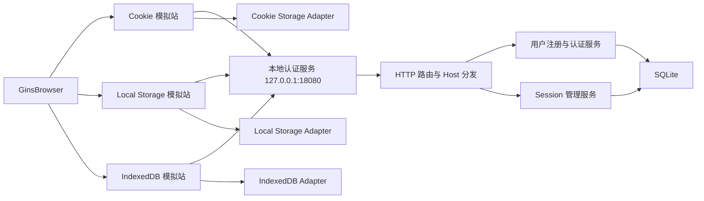

# DICloak 本地登录存储模拟站技术方案

## 1. 文档信息

| 项目 | 内容 |
| --- | --- |
| 文档状态 | 框架、服务和页面已实现；Windows 实机验证通过；Cookie、Local Storage、IndexedDB 预置环境与新环境持续保持业务用例已接入并完成相关真实回归 |
| 适用项目 | DICloak 自动化框架 |
| 建设对象 | Cookie、Local Storage、IndexedDB 三个本地模拟登录网站 |
| 运行平台 | Windows（已实机验证）；macOS、Linux（已按同一方案支持，待实机验证） |
| 核心原则 | 完全本地、固定 Origin、存储隔离、可持久化、可观测、可控制、无互联网依赖 |
| 兼容性原则 | 默认关闭、按需启用、旧配置兼容、既有功能与既有用例零侵入 |

### 1.1 当前实施与验证状态

截至 2026-08-18：

- 阶段一至阶段四已经实现，包括本地认证服务、SQLite、三站页面、专项预检、可选运行时服务、`KernelCDPSession`、`LocalAuthLabPage` 和 `BrowserStorageInspector`；
- 默认 Origin 已切换为 `*.dicloak.localhost`，服务固定监听 `127.0.0.1:18080`，同时保留显式 `origin_mode=custom_domains` 兼容模式；
- Windows 实机人工验证通过：控制首页和三个模拟站均可直接打开且页面表现正常，未修改 hosts、系统 DNS、系统代理或 DICloak APP 配置；
- Windows Google Chrome 151 + 原生 CDP 三站冒烟通过，且未注入 Host Resolver Rules、未覆盖代理；
- 三站均验证注册后不自动登录、登录后仅目标存储存在令牌、服务端撤销后被动掉登并清除目标令牌；
- `python -m unittest discover -s tests/p1 -p "test_*.py"` 当前共 100 条并全部通过，普通 `python run.py --precheck` 通过，P0 当前可发现 75 条；
- macOS、Linux 尚未记录实机验证结果，不以 Windows 结论替代两端实测；
- Cookie、Local Storage 与 IndexedDB 云端数据恢复业务用例均已由测试人员给出步骤并接入环境管理模块；预置环境三条和新环境持续保持三条在 2026-08-18 涉及全局设置快照恢复的 6 条联合真实回归中通过，结果 `total=6 passed=6 failed=0 errors=0 skipped=0 flaky=0`。本方案没有猜测未提供的云端接口或 APP DOM。

## 2. 背景

DICloak 支持将浏览器产生的 Cookie、Local Storage、IndexedDB 上传到云端，并通过接口获取或恢复云端浏览器数据。

如果直接使用互联网平台构造自动化场景，会受到以下不可控因素影响：

- 外部网络不稳定；
- 网站风控、验证码和设备校验；
- IP 请求频率限制；
- 账号封禁或登录策略调整；
- 第三方令牌过期；
- 页面结构和接口协议变化；
- CDN、DNS、证书或区域网络波动；
- 第三方平台服务不可用。

因此，项目需要建设三个完全本地的模拟登录网站，分别使用 Cookie、Local Storage、IndexedDB 保存登录令牌，为后续自动化提供稳定、独立、可重复的浏览器登录状态来源。

## 3. 方案边界

### 3.1 本方案包含

本方案只定义本地登录存储模拟站所需的：

- 总体架构；
- 技术选型；
- 三个网站的功能规格；
- 注册、登录、登录状态、退出和掉登处理；
- 用户和会话数据模型；
- Cookie、Local Storage、IndexedDB 存储实现；
- 页面状态和稳定 DOM 契约；
- HTTP API 契约；
- 自动化辅助管理接口；
- 服务启动、停止和健康检查能力；
- 配置、目录、日志和 Git 边界；
- Windows、macOS、Linux 的运行约束；
- 后续 HTTPS 扩展能力。

### 3.2 本方案不包含

以下内容不属于本文档范围，由自动化用例设计单独负责：

- 自动化用例场景设计；
- 自动化执行步骤；
- 自动化断言；
- 用例数据组合；
- P0、P1、P2 等用例等级划分；
- 用例前置和后置流程；
- DICloak 云端上传触发步骤；
- DICloak 云端下载或恢复步骤；
- DICloak 环境创建、打开、关闭方式；
- 云端接口轮询逻辑；
- 自动化失败重试策略；
- 自动化运行命令和结果判断标准。

本地模拟站只提供稳定、清晰、可控制、可查询和可清理的技术能力，不规定自动化如何编排这些能力。

## 4. 建设目标

建设三个相互独立的本地模拟登录网站：

| 网站 | 推荐地址 | 浏览器登录状态存储 |
| --- | --- | --- |
| Cookie 模拟站 | `http://cookie.dicloak.localhost:18080` | 持久化 HttpOnly Cookie |
| Local Storage 模拟站 | `http://localstorage.dicloak.localhost:18080` | Local Storage |
| IndexedDB 模拟站 | `http://indexeddb.dicloak.localhost:18080` | IndexedDB |

三个网站均提供：

- 账号注册；
- 账号登录；
- 注册完成后不自动登录；
- 当前登录状态查询；
- 当前登录账号展示；
- 主动退出登录；
- token 过期、撤销或无效后的被动掉登；
- 本地服务重启后保留注册账号；
- 稳定、可机器识别的页面状态；
- 无第三方资源、验证码、风控和互联网接口。

## 5. 核心设计原则

### 5.1 服务端账号与浏览器登录状态分离

注册账号保存在本地服务端 SQLite 数据库中，用于后续登录；浏览器登录状态只保存在对应网站指定的 Cookie、Local Storage 或 IndexedDB 中。

两类数据的职责必须严格分开：

| 数据 | 保存位置 | 是否属于浏览器登录状态 |
| --- | --- | --- |
| 用户名、密码哈希、账号状态 | 本地服务端 SQLite | 否 |
| Cookie 站点 token | 浏览器 Cookie | 是 |
| Local Storage 站点 token | 浏览器 Local Storage | 是 |
| IndexedDB 站点 token | 浏览器 IndexedDB | 是 |
| session 撤销和有效期信息 | 本地服务端 SQLite | 否 |

### 5.2 一个服务、三个独立 Origin

三个网站由同一个本地 Python 服务和同一个固定端口承载，但使用三个不同主机名形成三个独立 Origin。

不采用同一主机的三个不同端口作为最终方案。Cookie 的作用域不包含端口，同一主机下不同端口的 Cookie 隔离不符合三个独立网站的目标。

### 5.3 固定 Origin

Local Storage 和 IndexedDB 都按 `scheme + host + port` 隔离。服务端口不得在每次启动时随机变化，否则浏览器会把变化后的地址识别为新的 Origin。

默认固定为：

```text
127.0.0.1:18080
```

如果端口被未知程序占用，服务应明确失败，不应自动切换到随机端口。

### 5.4 三种认证存储严格隔离

每个站点只允许使用自己的目标存储保存认证 token：

| 网站 | Cookie | Local Storage | IndexedDB |
| --- | --- | --- | --- |
| Cookie 模拟站 | 保存认证 token | 禁止保存认证 token | 禁止保存认证 token |
| Local Storage 模拟站 | 禁止保存认证 token | 保存认证 token | 禁止保存认证 token |
| IndexedDB 模拟站 | 禁止保存认证 token | 禁止保存认证 token | 保存认证 token |

Session Storage、Service Worker、Cache Storage 和页面全局变量不得作为认证状态的持久化兜底。

## 6. 总体架构



系统由以下部分组成：

- 本地 HTTP 服务；
- Host 到站点的映射注册表；
- 用户注册和密码校验服务；
- session 签发、校验、撤销和过期处理；
- SQLite 持久化层；
- Cookie、Local Storage、IndexedDB 三个前端存储适配器；
- 统一登录/注册/状态页面；
- 可选控制首页；
- 健康检查和自动化管理接口；
- 独立命令行与程序化生命周期入口。

## 7. 域名和网络实现

### 7.1 默认 localhost 模式

默认使用保留给本机回环访问的 `.localhost` 域名，不要求 Windows、macOS 或 Linux 节点修改 hosts：

```text
sync.dicloak.localhost
cookie.dicloak.localhost
localstorage.dicloak.localhost
indexeddb.dicloak.localhost
```

该模式配置为 `origin_mode: localhost`。各平台保持相同域名和端口，不依赖管理员/root 权限，也不修改系统 DNS 或代理。Chromium 内核应把这些域名作为本地地址访问；专项预检和真实浏览器冒烟负责验证当前内核确实可以访问。

### 7.2 自定义域名兼容模式

如果待测 DICloak 功能明确排除 `.localhost` 数据，可切换为 `origin_mode: custom_domains` 并覆盖域名。兼容示例仍可使用 `.test` 域名，但此时由运行节点自行把域名解析到回环地址：

```text
127.0.0.1 sync.dicloak.test
127.0.0.1 cookie.sync.dicloak.test
127.0.0.1 localstorage.sync.dicloak.test
127.0.0.1 indexeddb.sync.dicloak.test
```

框架只校验自定义域名的解析结果，不自动编辑 hosts。该兼容模式不是默认方案。

### 7.3 服务监听范围

服务默认只监听：

```text
127.0.0.1:18080
```

默认不监听 `0.0.0.0`，避免局域网其他设备直接访问本地账号、session 和管理接口。

### 7.4 Host 分发

服务根据 HTTP `Host` 请求头确定当前站点：

```text
sync.dicloak.localhost
  → site_id=control

cookie.dicloak.localhost
  → site_id=cookie

localstorage.dicloak.localhost
  → site_id=localstorage

indexeddb.dicloak.localhost
  → site_id=indexeddb
```

必须维护 Host 白名单。未知 Host 返回 `400` 或 `404`，不得默认映射到任一认证站点。

### 7.5 代理约束

DICloak 环境访问上述域名时，应确保请求保留在本机回环网络，不得发往外部代理。服务本身不负责修改 DICloak 环境代理配置，但应在健康信息中暴露实际访问 Host、远端地址和服务实例 ID，便于定位请求是否到达本地服务。

## 8. 技术选型

### 8.1 后端语言

使用 Python，与现有 DICloak 自动化框架保持一致。

### 8.2 HTTP 服务

使用 Python 标准库：

- `http.server.ThreadingHTTPServer`
- `http.server.BaseHTTPRequestHandler`

选择标准库的原因：

- 当前项目已经存在同类本地 HTTP 实现；
- 无需引入 Flask、FastAPI、Uvicorn 等新依赖；
- Windows、macOS、Linux 可直接运行；
- 适合本地、小并发、固定功能的自动化模拟服务；
- 易于嵌入现有 Python 生命周期；
- 不引入 Node.js 或前端构建链；
- 降低远端节点依赖差异。

HTTP Handler 不直接堆积全部业务逻辑，应拆分为路由、请求解析、响应封装、用户服务、session 服务、数据库访问和站点注册表。

### 8.3 数据库

使用 Python 标准库 `sqlite3`。

建议启用：

```sql
PRAGMA journal_mode=WAL;
PRAGMA foreign_keys=ON;
PRAGMA busy_timeout=5000;
```

SQLite 负责保存：

- 注册账号；
- 密码哈希和 Salt；
- 账号启用状态；
- session 状态；
- token 撤销信息；
- schema 版本；
- 必要的服务运行元数据。

SQLite 不保存：

- 浏览器 Cookie 数据库；
- 浏览器 Local Storage 文件；
- 浏览器 IndexedDB 文件；
- DICloak 云端数据；
- 完整明文 token。

### 8.4 前端

使用：

- 原生 HTML；
- 原生 CSS；
- Vanilla JavaScript；
- Fetch API；
- IndexedDB 原生 API。

不使用：

- npm；
- Webpack；
- Vite；
- React；
- Vue；
- 第三方 UI 组件；
- CDN；
- 外部字体；
- 统计脚本；
- Service Worker。

所有页面和静态资源随项目维护，浏览器加载页面时不访问互联网。

## 9. 建议目录结构

```text
core/
└── local_auth_lab/
    ├── __init__.py
    ├── server.py
    ├── router.py
    ├── config.py
    ├── database.py
    ├── password.py
    ├── token.py
    ├── user_service.py
    ├── session_service.py
    ├── site_registry.py
    ├── request.py
    └── response.py

web_templates/
└── local_auth_lab/
    ├── auth.html
    ├── control.html
    └── static/
        ├── auth.js
        ├── cookie_storage.js
        ├── local_storage.js
        ├── indexeddb_storage.js
        └── styles.css

test_data/
└── local_auth_lab/
    ├── .gitkeep
    └── auth.db
```

现有 `core/local_http.py` 继续保持轻量连通性探针职责，不直接扩展为注册登录系统，避免影响已有调用方。

## 10. 站点与账号隔离

三个网站物理上共用一个 SQLite 文件，逻辑上按 `site_id` 隔离账号。

允许的 `site_id`：

```text
cookie
localstorage
indexeddb
```

同一用户名可以在三个站点分别注册：

```text
site_id=cookie, username=automation
site_id=localstorage, username=automation
site_id=indexeddb, username=automation
```

Cookie 站点注册的账号不会自动成为 Local Storage 或 IndexedDB 站点的账号。

## 11. 用户数据模型

建议用户表：

```sql
CREATE TABLE users (
    id INTEGER PRIMARY KEY AUTOINCREMENT,
    site_id TEXT NOT NULL,
    username TEXT NOT NULL,
    password_hash TEXT NOT NULL,
    password_salt TEXT NOT NULL,
    enabled INTEGER NOT NULL DEFAULT 1,
    created_at TEXT NOT NULL,
    updated_at TEXT NOT NULL,
    UNIQUE(site_id, username)
);
```

字段要求：

- `site_id` 只能使用站点注册表中的允许值；
- `username` 在同一站点内唯一；
- `password_hash` 不保存明文；
- `enabled` 用于控制账号是否可登录；
- 时间统一使用 UTC ISO 8601 字符串。

## 12. 密码实现

密码使用 Python 标准库 `hashlib.scrypt` 计算哈希。

每个账号生成独立随机 Salt：

```text
salt = secrets.token_bytes(16)
```

建议以带版本的格式保存：

```text
scrypt$v1$<salt-base64>$<hash-base64>
```

密码比较使用 `hmac.compare_digest`。

禁止：

- 明文保存密码；
- 在日志中输出密码；
- 在 URL 参数中传输密码；
- 在错误响应中返回密码哈希或 Salt；
- 将注册请求完整正文写入日志。

## 13. Session Token 实现

使用带签名的 session token，签名算法为 HMAC-SHA256。

建议 token payload：

```json
{
  "version": 1,
  "siteId": "cookie",
  "username": "automation",
  "runId": "",
  "issuedAt": 1785724212,
  "expiresAt": 1785810612,
  "jti": "随机会话ID"
}
```

建议 token 格式：

```text
base64url(payload) + "." + base64url(signature)
```

签名密钥从环境变量或 Git 忽略的本地配置读取，例如：

```text
DICLOAK_AUTH_LAB_SIGNING_SECRET
```

真实签名密钥不得写入代码、示例配置或 Git 仓库。

签名 token 应支持：

- 服务重启后继续验证；
- 检测 payload 被修改；
- 绑定具体站点；
- 绑定具体账号；
- 设置有效期；
- 通过 `jti` 单独撤销；
- 携带可选的 `runId`；
- 生成不暴露完整 token 的指纹。

Token 指纹建议使用完整 token 的 SHA-256 前 12 个十六进制字符。

## 14. Session 数据模型

建议 session 表：

```sql
CREATE TABLE sessions (
    id INTEGER PRIMARY KEY AUTOINCREMENT,
    site_id TEXT NOT NULL,
    username TEXT NOT NULL,
    jti TEXT NOT NULL,
    token_hash TEXT NOT NULL,
    run_id TEXT NOT NULL DEFAULT '',
    issued_at TEXT NOT NULL,
    expires_at TEXT NOT NULL,
    revoked_at TEXT NOT NULL DEFAULT '',
    revoke_reason TEXT NOT NULL DEFAULT '',
    UNIQUE(site_id, jti)
);
```

数据库只保存 token 的 SHA-256 哈希，不保存完整 token。

认证时检查：

- token 格式有效；
- HMAC 签名正确；
- token 未过期；
- token 的 `siteId` 与当前 Host 对应站点一致；
- 用户存在且未禁用；
- session 记录存在；
- session 未被撤销；
- token 哈希与 session 记录一致。

## 15. 页面功能

### 15.1 注册

注册页面提供：

- 用户名；
- 密码；
- 确认密码；
- 注册按钮；
- 注册结果提示；
- 返回登录入口。

注册成功后：

- 将账号写入服务端 SQLite；
- 不创建 session；
- 不签发 token；
- 不设置 Cookie；
- 不写 Local Storage；
- 不写 IndexedDB；
- 不自动登录；
- 页面显示“注册成功，请登录”；
- 当前状态仍为“未登录”；
- 当前账号显示为 `—`。

### 15.2 登录

登录页面提供：

- 用户名；
- 密码；
- 登录按钮；
- 前往注册入口；
- 当前状态；
- 业务错误提示。

登录成功后：

- 创建 session；
- 签发 token；
- 根据站点类型写入唯一允许的浏览器存储；
- 显示当前账号；
- 显示存储类型；
- 显示可选 `runId`；
- 显示 token 指纹；
- 不在页面显示完整 token。

### 15.3 当前登录状态

页面初始化时：

- 读取当前站点对应的浏览器存储；
- 调用 session 状态接口；
- 根据接口结果渲染当前状态；
- token 明确失效时清理对应存储；
- 服务不可用时保留 token，不将服务故障误判为掉登。

### 15.4 主动退出登录

退出登录时：

- 服务端撤销当前 session；
- 写入撤销时间和原因；
- 清除当前站点对应的浏览器 token；
- 页面显示“未登录”；
- 当前账号显示为 `—`。

退出操作具备幂等性。未登录、已撤销或 token 缺失时再次退出，不返回系统级错误。

### 15.5 被动掉登

以下情况视为被动掉登：

- token 过期；
- token 被服务端撤销；
- token 签名无效；
- token 不属于当前站点；
- 账号被禁用；
- session 记录不存在。

服务端明确返回未认证后，页面清除目标存储中的无效 token，并显示：

```text
当前状态：未登录
当前账号：—
```

可额外显示稳定的掉登原因，但不得向页面暴露敏感内部信息。

## 16. 页面状态模型

统一内部状态：

```text
INITIALIZING
UNAUTHENTICATED
AUTHENTICATED
SERVICE_UNAVAILABLE
```

| 内部状态 | 页面中文文案 | 当前账号 |
| --- | --- | --- |
| `INITIALIZING` | 正在检查登录状态 | `—` |
| `UNAUTHENTICATED` | 未登录 | `—` |
| `AUTHENTICATED` | 已登录 | 实际用户名 |
| `SERVICE_UNAVAILABLE` | 服务不可用 | `—` |

只有以下明确认证结果可以显示“未登录”：

- 浏览器中没有 token；
- 接口返回 token 过期；
- 接口返回 token 被撤销；
- 接口返回 token 无效；
- 接口返回账号不可用。

以下情况必须显示“服务不可用”，不得显示“未登录”，也不得删除浏览器 token：

- 本地服务连接失败；
- 请求超时；
- HTTP 500；
- 响应格式错误；
- 页面脚本无法完成状态检查。

## 17. 页面展示契约

登录成功后统一显示：

```text
当前状态：已登录
当前账号：automation
存储类型：Cookie / Local Storage / IndexedDB
Run ID：...
Token 指纹：8c6a1c4b913e
```

未登录时统一显示：

```text
当前状态：未登录
当前账号：—
```

服务不可用时统一显示：

```text
当前状态：服务不可用
当前账号：—
```

稳定 DOM 属性：

```text
data-testid="site-name"
data-testid="storage-type"
data-testid="auth-status"
data-testid="current-account"
data-testid="run-id"
data-testid="token-fingerprint"
data-testid="username-input"
data-testid="password-input"
data-testid="confirm-password-input"
data-testid="register-button"
data-testid="login-button"
data-testid="logout-button"
data-testid="message"
```

这些属性属于模拟站对外技术契约，不规定自动化如何使用或断言。

## 18. 浏览器存储适配层

前端统一定义：

```javascript
storageAdapter.setToken(session)
storageAdapter.getToken()
storageAdapter.clearToken()
storageAdapter.storageType
```

根据当前 Host 选择对应适配器。

### 18.1 Cookie Adapter

Cookie 由服务端设置和删除。

登录成功响应：

```text
Set-Cookie:
dicloak_auth=<token>;
Path=/;
HttpOnly;
SameSite=Lax;
Max-Age=86400
```

默认不设置 `Domain`，生成 host-only Cookie。

HTTP 模式默认不加 `Secure`；启用 HTTPS 后增加 `Secure`。

Cookie 站点的前端无法直接读取 HttpOnly Cookie，页面通过 `/api/session` 查询状态，由浏览器自动携带 Cookie。

Cookie 站点不得将认证 token 写入 Local Storage 或 IndexedDB。

### 18.2 Local Storage Adapter

固定 key：

```text
dicloak_auth
```

建议值：

```json
{
  "version": 1,
  "storageType": "localStorage",
  "username": "automation",
  "runId": "",
  "token": "...",
  "tokenFingerprint": "...",
  "issuedAt": "...",
  "expiresAt": "..."
}
```

认证请求使用：

```text
Authorization: Bearer <token>
```

退出或 token 明确失效后执行：

```javascript
localStorage.removeItem("dicloak_auth");
```

Local Storage 站点不得创建认证 Cookie，也不得将认证 token 写入 IndexedDB。

### 18.3 IndexedDB Adapter

固定结构：

```text
Database: dicloak_auth
Version: 1
Object Store: sessions
Key Path: id
Current Key: current
```

记录：

```json
{
  "id": "current",
  "version": 1,
  "storageType": "indexedDB",
  "username": "automation",
  "runId": "",
  "token": "...",
  "tokenFingerprint": "...",
  "issuedAt": "...",
  "expiresAt": "..."
}
```

IndexedDB 写入必须等待 transaction 的 `complete` 事件，不能只等待 `put()` 请求成功。

退出或 token 明确失效后删除：

```text
sessions/current
```

IndexedDB 站点不得创建认证 Cookie，也不得将认证 token 写入 Local Storage。

## 19. 公开 HTTP API

### 19.1 注册

```text
POST /api/register
```

请求：

```json
{
  "username": "automation",
  "password": "password",
  "confirmPassword": "password"
}
```

`site_id` 不由客户端提交，必须根据请求 Host 解析。

成功响应：

```json
{
  "success": true,
  "code": "REGISTERED",
  "message": "注册成功，请登录",
  "siteId": "cookie",
  "username": "automation"
}
```

重复账号：

```json
{
  "success": false,
  "code": "USERNAME_EXISTS",
  "message": "账号已存在"
}
```

注册成功响应不得包含 token，也不得设置认证 Cookie。

### 19.2 登录

```text
POST /api/login
```

请求：

```json
{
  "username": "automation",
  "password": "password",
  "runId": ""
}
```

Local Storage 或 IndexedDB 站点成功响应：

```json
{
  "success": true,
  "code": "AUTHENTICATED",
  "siteId": "localstorage",
  "storageType": "localStorage",
  "username": "automation",
  "runId": "",
  "token": "...",
  "tokenFingerprint": "8c6a1c4b913e",
  "issuedAt": "...",
  "expiresAt": "..."
}
```

Cookie 站点通过响应头设置 HttpOnly Cookie，JSON 响应不返回完整 token，只返回账号、状态和指纹。

业务错误码：

```text
INVALID_CREDENTIALS
ACCOUNT_DISABLED
VALIDATION_ERROR
SITE_NOT_SUPPORTED
```

账号不存在和密码错误统一返回“账号或密码错误”。

### 19.3 登录状态

```text
GET /api/session
```

Cookie 站点从 `dicloak_auth` Cookie 读取 token；Local Storage 和 IndexedDB 站点从 `Authorization: Bearer <token>` 读取 token。

已登录响应：

```json
{
  "authenticated": true,
  "status": "AUTHENTICATED",
  "siteId": "indexeddb",
  "storageType": "indexedDB",
  "username": "automation",
  "runId": "",
  "tokenFingerprint": "8c6a1c4b913e",
  "issuedAt": "...",
  "expiresAt": "..."
}
```

未登录或掉登响应：

```json
{
  "authenticated": false,
  "status": "UNAUTHENTICATED",
  "reason": "TOKEN_MISSING"
}
```

支持的 reason：

```text
TOKEN_MISSING
TOKEN_EXPIRED
TOKEN_REVOKED
TOKEN_INVALID
TOKEN_SITE_MISMATCH
ACCOUNT_DISABLED
SESSION_NOT_FOUND
```

HTTP 状态：

- 已登录：`200`；
- token 缺失、过期、撤销或无效：`401`；
- 服务内部异常：`500`。

### 19.4 退出登录

```text
POST /api/logout
```

服务端：

- 读取当前 token；
- 找到对应 session；
- 写入 `revoked_at`；
- 写入 `revoke_reason=USER_LOGOUT`；
- Cookie 站点返回清除 Cookie 的响应头；
- 返回未登录状态。

Cookie 清除：

```text
Set-Cookie:
dicloak_auth=;
Path=/;
Max-Age=0;
Expires=<past date>;
HttpOnly;
SameSite=Lax
```

退出接口必须幂等。

## 20. 自动化支持接口

为方便外部自动化框架管理本地服务，可提供独立管理接口，但本文档不规定用例如何调用。

统一路径：

```text
/__automation__/...
```

建议提供：

```text
GET  /__automation__/health
GET  /__automation__/version
POST /__automation__/users/ensure
POST /__automation__/sessions/revoke
POST /__automation__/cleanup
GET  /__automation__/state
```

管理接口必须：

- 只允许回环地址访问；
- 校验 Host；
- 要求本地管理密钥；
- 不在登录页面中暴露；
- 不返回密码；
- 不返回完整 token；
- 不在日志中打印敏感请求正文。

管理密钥通过请求头传递：

```text
X-Auth-Lab-Admin-Key: ...
```

管理密钥从环境变量或 Git 忽略的本地配置读取，例如：

```text
DICLOAK_AUTH_LAB_ADMIN_KEY
```

`users/ensure` 只负责确保服务器端账号存在，不创建浏览器 session，不写入浏览器存储。

`cleanup` 应支持按 `site_id`、`username`、`run_id` 或 `jti` 精确清理，避免只能清空整个数据库。

## 21. 控制首页

可选地址：

```text
http://sync.dicloak.localhost:18080
```

控制首页只用于展示和导航，不注册、不登录、不产生认证 token。

建议展示：

- 服务状态；
- 服务版本；
- 服务实例 ID；
- 当前监听地址；
- SQLite schema 版本；
- Cookie 模拟站入口；
- Local Storage 模拟站入口；
- IndexedDB 模拟站入口。

控制首页不得提供不受保护的全量账号、session 或 token 查看能力。

## 22. 服务生命周期

### 22.1 独立命令行模式

用于人工调试或长期运行：

```powershell
python -m core.local_auth_lab --config config/config.yaml
```

建议支持：

```text
--host
--port
--db-path
--templates-dir
--log-level
```

### 22.2 程序化模式

提供生命周期对象：

```text
LocalAuthLabServer
```

对外能力：

```text
start()
wait_ready()
health_check()
base_urls
stop()
```

### 22.3 启动行为

服务启动时：

1. 加载并校验配置；
2. 校验 Host 注册表；
3. 检查固定端口；
4. 端口占用时读取健康接口；
5. 如果是兼容的同类服务，报告现有实例；
6. 如果是未知程序占用，明确失败；
7. 初始化或迁移 SQLite schema；
8. 启动后台服务线程；
9. 等待健康检查成功；
10. 返回三个固定 URL。

服务不得在端口冲突时自动切换到随机端口。

### 22.4 停止行为

服务停止时：

- 停止接收新请求；
- 等待正在处理的请求结束；
- 关闭数据库连接；
- 释放监听端口；
- 不删除持久账号数据库；
- 不擅自修改 hosts 文件。

## 23. 配置建议

示例配置：

```yaml
local_auth_lab:
  # 可选能力默认关闭；只有明确声明依赖该服务的运行范围才允许启动
  enabled: false
  host: "127.0.0.1"
  port: 18080
  database_path: "test_data/local_auth_lab/auth.db"
  template_dir: "web_templates/local_auth_lab"

  # 默认无需修改 hosts；仅在产品明确排除 localhost 时切换为 custom_domains
  origin_mode: "localhost"
  domains:
    control: "sync.dicloak.localhost"
    cookie: "cookie.dicloak.localhost"
    localstorage: "localstorage.dicloak.localhost"
    indexeddb: "indexeddb.dicloak.localhost"

  session:
    ttl_seconds: 86400
    signing_secret_env: "DICLOAK_AUTH_LAB_SIGNING_SECRET"

  cookie:
    name: "dicloak_auth"
    http_only: true
    same_site: "Lax"
    secure: false
    path: "/"

  database:
    journal_mode: "WAL"
    busy_timeout_ms: 5000

  automation_api:
    enabled: true
    admin_key_env: "DICLOAK_AUTH_LAB_ADMIN_KEY"
```

示例配置只保存环境变量名，不保存真实密钥。

## 24. 健康检查

健康接口至少返回：

```json
{
  "status": "ok",
  "service": "dicloak-local-auth-lab",
  "version": "1.0.0",
  "instanceId": "...",
  "host": "127.0.0.1",
  "port": 18080,
  "database": "ready",
  "schemaVersion": 1,
  "sites": ["cookie", "localstorage", "indexeddb"]
}
```

健康接口不得返回：

- 数据库绝对路径；
- 注册用户名列表；
- token；
- signing secret；
- automation admin key；
- 密码或密码哈希。

## 25. 日志规范

日志建议包含：

- 时间；
- 日志级别；
- request ID；
- site ID；
- HTTP 方法；
- 路径；
- 状态码；
- 耗时；
- 用户名的脱敏值；
- session `jti` 的脱敏值；
- 服务实例 ID。

日志不得包含：

- 明文密码；
- 完整 token；
- `Authorization` 请求头；
- Cookie 完整内容；
- signing secret；
- automation admin key；
- 注册和登录请求的完整正文。

## 26. 稳定性和安全约束

服务必须遵守：

- 只绑定回环地址；
- 不加载互联网资源；
- 不接受未知 Host；
- 不允许目录遍历；
- 静态文件路径限制在模板目录；
- 所有响应使用 UTF-8；
- API 使用统一 JSON 格式；
- 登录相关响应设置 `Cache-Control: no-store`；
- 页面设置基础 Content Security Policy；
- 校验 `Origin` 和 `Host`；
- 修改类接口只接受 `POST`；
- 不在 URL 参数中传密码和 token；
- Cookie 使用 host-only；
- 数据库写操作使用事务；
- 时间统一使用 UTC；
- 页面不使用动画和随机延迟；
- IndexedDB 操作具有明确成功或失败状态；
- 网络错误与未登录状态严格区分；
- 三个站点不得相互共享认证 token；
- 未知异常返回稳定错误码，不将 Python traceback 返回页面。

## 27. HTTP 与 HTTPS

第一版使用 HTTP，避免引入本地证书签发、安装和信任链差异。

架构预留 HTTPS 配置：

```yaml
local_auth_lab:
  tls:
    enabled: false
    cert_file: ""
    key_file: ""
```

启用 HTTPS 后：

- URL 协议切换为 `https`；
- Cookie 自动增加 `Secure`；
- Windows、macOS、Linux 节点需要信任同一测试 CA；
- 域名和端口仍保持固定。

第一版不负责自动生成或安装系统证书，只保证架构允许后续扩展。

## 28. Git 和运行数据边界

应提交：

- 服务端代码；
- 数据库 schema；
- HTML、CSS、JavaScript；
- 示例配置；
- localhost 默认域名及自定义域名兼容模式说明；
- 启动和停止说明；
- API 文档。

不应提交：

- `auth.db`；
- SQLite WAL/SHM 文件；
- 明文账号密码；
- signing secret；
- automation admin key；
- session token；
- 运行日志；
- 临时数据库；
- 浏览器 Profile；
- DICloak 云端响应中的敏感数据。

建议忽略：

```gitignore
test_data/local_auth_lab/*.db
test_data/local_auth_lab/*.db-shm
test_data/local_auth_lab/*.db-wal
config/local_auth_lab.yaml
logs/local_auth_lab/
```

## 29. 跨平台要求

Windows、macOS、Linux 应保持：

- 相同域名；
- 相同端口；
- 相同 SQLite schema；
- 相同 token 签名算法；
- 相同页面和静态资源；
- 相同 API code；
- 相同浏览器存储 key、数据库名和 Object Store；
- 相同页面 `data-testid`；
- 相同 UTF-8 编码；
- 相同 session 有效期语义。

平台差异只允许出现在：

- 自定义域名兼容模式下的本机 DNS/hosts 管理方式；
- 服务进程启动方式；
- 本地配置文件路径；
- 可选 TLS 证书信任方式。

## 30. 实现阶段建议

本节只描述工程实现顺序，不涉及自动化用例设计。

### 阶段一：基础服务

- 建立 `core/local_auth_lab` 包；
- 实现固定 Host 和端口；
- 实现静态页面；
- 实现健康检查；
- 实现启动和停止能力；
- 实现配置加载和校验。

### 阶段二：账号和 session

- 建立 SQLite schema；
- 实现 scrypt 密码哈希；
- 实现注册；
- 实现登录；
- 实现 HMAC token；
- 实现 session 查询、撤销和过期。

### 阶段三：三种存储适配器

- 实现 HttpOnly Cookie；
- 实现 Local Storage；
- 实现 IndexedDB；
- 统一页面状态模型；
- 实现未登录、已登录和服务不可用展示。

### 阶段四：管理和运行能力

- 实现自动化管理接口；
- 实现精确清理能力；
- 实现服务版本和实例 ID；
- 完善日志脱敏；
- 补充 localhost、自定义域名兼容模式和跨平台运行说明；
- 完善 Git 忽略规则。

### 阶段五：可选增强

- HTTPS；
- Secure Cookie；
- 更细粒度的 session 撤销原因；
- 数据库 schema 迁移；
- 独立运行状态页面；
- 更完善的诊断接口。

## 31. 与自动化框架的集成原则

本地模拟站以“可选运行时服务”的方式接入现有自动化框架，不成为 APP 启动、CDP 连接、环境预检或全部 P0 的强制依赖。

集成必须满足以下原则：

- 现有配置中没有 `local_auth_lab` 时，行为与集成前完全一致；
- `local_auth_lab.enabled=false` 时，不进行域名、端口、数据库、密钥或模板检查；
- 没有选中依赖本地模拟站的运行范围时，不创建服务管理器、不占用端口、不打开数据库；
- 现有用例不需要增加任何类属性、装饰器、配置或前后置代码；
- 现有 APP CDP、内核 CDP、恢复、重试、截图、飞书和远程执行链路保持原行为；
- 新能力只由明确声明依赖的新增运行范围触发；
- 本地模拟站故障不能导致无关模块的预检、发现或执行失败；
- 第一版不得通过重构现有公共代码来“顺便统一架构”；
- 所有新增默认值都必须向后兼容真实 `config/config.yaml`；
- 所有新增运行文件、数据库和密钥都必须与 Git、远端快照和现有测试数据隔离。

## 32. 运行时服务管理层

建议新增通用运行时服务管理层：

```text
core/runtime_services.py
```

本地模拟站实现为：

```text
LocalAuthLabServer
```

通用运行时服务接口：

```text
RuntimeService
├── name
├── precheck()
├── start()
├── wait_ready()
├── health_check()
├── diagnostics()
└── stop()
```

`RuntimeServiceManager` 负责：

- 注册可选运行时服务；
- 根据本次运行范围收集服务依赖；
- 只预检本次需要的服务；
- 按顺序启动并等待就绪；
- 记录服务实例和所有权；
- 在 Runner 最外层 `finally` 中逆序停止本次拥有的服务；
- 复用兼容的既有服务实例；
- 拒绝占用固定端口的未知服务；
- 输出脱敏健康信息；
- 不干预未声明依赖的用例。

### 32.1 运行范围声明

需要本地模拟站的新增测试类可以声明：

```python
REQUIRED_RUNTIME_SERVICES = {"local_auth_lab"}
```

该声明只描述运行环境能力依赖，不定义测试步骤和断言。

Runner 收集依赖时必须使用兼容读取：

```text
测试类没有 REQUIRED_RUNTIME_SERVICES
→ 视为空集合
→ 不改变现有执行行为
```

禁止要求所有现有测试类补充空集合声明。

### 32.2 空依赖快速路径

当本次 suite 不需要任何可选运行时服务时，Runner 必须走原执行路径：

```text
required_runtime_services = empty
→ 不实例化 LocalAuthLabServer
→ 不检查 18080 端口
→ 不解析三个本地域名
→ 不读取 auth.db
→ 不要求 signing secret
→ 不要求 admin key
→ 不增加服务启动和停止耗时
```

这条快速路径是保证现有功能和现有用例不受影响的核心约束。

## 33. Runner 生命周期集成

只有当本次 suite 明确依赖 `local_auth_lab` 时，`AutomationRunner` 才加入以下步骤：

```text
1. 加载配置
2. 发现并筛选测试
3. 收集本次运行所需的可选运行时服务
4. 执行原有基础预检
5. 执行本次所需服务的专项预检
6. 启动并等待本地模拟站就绪
7. 启动或附加 DICloak APP
8. 执行原有 APP CDP 启动检查
9. 执行 suite
10. 执行原有 APP 释放或关闭逻辑
11. 停止本次 Runner 拥有的本地模拟站
```

### 33.1 原有执行顺序保护

对于不依赖本地模拟站的 suite，以下顺序不得改变：

```text
基础预检
→ 用例发现和筛选
→ APP 托管或 attach
→ APP CDP 检查
→ suite 执行
→ APP 释放或关闭
```

不得为了接入本地模拟站而改变：

- `test_01_kernel_integrity` 的优先级；
- 断言失败不重试、执行异常才重试的规则；
- 用例前后恢复机制；
- 失败截图发生在恢复之前的顺序；
- `--attach-existing-app` 的 APP 保留语义；
- 现有退出码；
- 飞书汇总结构；
- CLI、UI 本机和远程运行元数据。

### 33.2 停止顺序

本地模拟站必须晚于浏览器环境和框架托管 APP 停止：

```text
suite 完成
→ 用例后恢复
→ 关闭框架托管 APP / 释放 CDP
→ 停止本地模拟站
```

不能先停止本地模拟站再关闭 GinsBrowser，避免仍在运行的本地页面突然进入“服务不可用”，影响恢复和失败现场。

### 33.3 重试期间保持服务稳定

当前框架会对 unittest `error` 重新加载 `TestCase` 后重试。本地模拟站生命周期应覆盖整个 suite，而不是单次 attempt：

```text
整个 suite
└── LocalAuthLabServer 只启动一次
    ├── 第一次执行
    ├── 必要的重试
    └── suite 结束后停止
```

重试期间不得：

- 更换端口；
- 更换域名；
- 重建数据库；
- 重新生成 signing secret；
- 自动删除全部账号或 session；
- 将正在运行的兼容服务判定为端口冲突。

## 34. 服务实例所有权

固定端口可能已由人工启动的兼容服务占用。框架必须区分服务是否属于当前运行。

### 34.1 本次运行启动的服务

```text
owned_by_current_run=true
```

Runner 负责：

- 记录 PID、实例 ID 和启动时间；
- 在最终 `finally` 中停止；
- 只停止记录的服务实例；
- 停止失败时记录明确警告；
- 不使用模糊进程名批量结束其他 Python 进程。

### 34.2 已存在的兼容服务

如果固定端口已占用，框架请求健康接口并校验：

- `service=dicloak-local-auth-lab`；
- API 主版本兼容；
- schema 版本兼容；
- 三个站点齐全；
- 域名和端口一致。

兼容时：

```text
owned_by_current_run=false
```

Runner 可以复用，但运行结束时不得关闭。

### 34.3 未知端口占用

如果 `18080` 被未知程序或不兼容版本占用：

- 明确报告端口冲突；
- 不杀进程；
- 不使用更强的进程终止方式；
- 不改用随机端口；
- 不影响不依赖本地模拟站的其他运行范围。

## 35. APP CDP、内核 CDP 与本地网站的职责分离

### 35.1 APP CDP

现有 `core/cdp_driver.py` 继续连接：

```text
http://127.0.0.1:9222
```

职责保持不变：

- 控制 DICloak Electron APP；
- 操作环境、设置和业务页面；
- 打开或关闭指纹环境；
- 监听 APP 请求和响应；
- 操作浏览器数据同步相关 APP 界面。

本地模拟站不得接管或替换 APP `CDPDriver`。

### 35.2 GinsBrowser 内核 CDP

现有 `core/kernel_process.py` 继续负责解析具体 GinsBrowser 进程和动态 CDP 端口。

建议新增独立通用封装：

```text
core/kernel_cdp_session.py
```

```text
KernelCDPSession
```

该封装负责：

- 连接具体内核 CDP；
- 创建和关闭 Target；
- 页面导航；
- DOM 查询；
- 输入、点击和文本读取；
- Runtime JavaScript 执行；
- 页面就绪等待；
- 内核页面截图；
- Cookie、Storage 和 IndexedDB 协议调用。

### 35.3 不重构现有 kernel_cdp.py

第一版必须新增 `KernelCDPSession`，不得为了复用而大范围重构现有 `core/kernel_cdp.py`。

现有文件中的网站限制、书签、扩展、DevTools 和密码按钮验证继续使用原实现。新能力只调用新封装，避免影响已经验证的全局设置和内核完整性用例。

后续只有在新封装稳定并完成完整回归后，才允许单独评估迁移现有函数；迁移不属于本方案第一版范围。

## 36. Page Object 与框架能力

### 36.1 本地模拟站 Page Object

建议新增：

```text
pages/local_auth_lab_page.py
locators/local_auth_lab_locators.yaml
```

`LocalAuthLabPage` 基于 `KernelCDPSession`，提供页面级能力：

```text
open_site(site_type)
open_register()
open_login()
register(username, password)
login(username, password, run_id="")
logout()
read_status()
read_current_account()
read_storage_type()
read_run_id()
read_token_fingerprint()
wait_status(expected_status)
```

三个网站共用同一套 `data-testid`，因此只建立一个 Page Object 和一份定位器。

不得把这些方法加入：

- `EnvironmentPage`；
- `GlobalSettingsPage`；
- `LoginPage`；
- APP 的 `CDPDriver`；
- 现有本地连通性探针。

### 36.2 浏览器存储检查器

建议新增：

```text
core/browser_storage.py
```

```text
BrowserStorageInspector
```

对外提供结构化能力：

```text
get_cookies(origin)
get_local_storage(origin)
get_indexeddb_databases(origin)
get_indexeddb_records(origin, database, object_store)
snapshot(origin)
```

默认日志和对象 `repr` 只显示 token 指纹，不显示完整 token。

### 36.3 本地服务管理 Client

建议新增：

```text
core/local_auth_lab/client.py
```

```text
LocalAuthLabClient
```

封装：

```text
health()
version()
ensure_user()
get_state()
revoke_session()
cleanup()
```

Client 只负责本地服务管理 API，不操作 APP、不操作 GinsBrowser，也不调用 DICloak 云端。

### 36.4 DICloak 云端接口分离

本地网站不得知道 DICloak 环境 ID、团队、登录凭据或云端接口。

DICloak 浏览器数据接口如果需要框架封装，应独立放置：

```text
core/browser_data_cloud_api.py
```

```text
BrowserDataCloudClient
```

它与 `LocalAuthLabClient` 是两个独立组件，防止本地测试靶场与被测云端系统耦合。

### 36.5 APP 浏览器数据同步页面

如果产品功能在 APP 中有明确页面入口，应在真实 CDP 探测后新增：

```text
pages/browser_data_sync_page.py
locators/browser_data_sync_locators.yaml
```

不得在未确认真实页面、弹窗、状态和接口前凭假设编写定位器；也不得为此修改现有环境、全局设置或成员 Page Object。

## 37. 预检兼容策略

### 37.1 现有全局预检保持不变

现有 `python run.py --precheck` 不应因为新增可选服务而要求：

- 本地模拟站 Origin 已完成专项校验；
- `18080` 可用；
- auth.db 可写；
- signing secret 已设置；
- admin key 已设置。

否则所有现有用户在尚未使用本地模拟站时都会出现新的预检失败。

第一版可采用以下规则：

```text
普通 --precheck
→ 保持现有检查集合

选中声明 local_auth_lab 的 suite
→ 在运行前追加 LocalAuthLabPrechecker
```

如果未来需要独立检查可选服务，应新增明确参数，而不是改变现有 `--precheck` 语义。

### 37.2 专项预检内容

只有本次运行需要本地模拟站时才检查：

| 检查项 | 内容 |
| --- | --- |
| 配置 | `local_auth_lab.enabled=true` 且字段合法 |
| 端口 | 固定端口未被未知服务占用 |
| Origin 模式 | `localhost` 模式校验域名后缀；`custom_domains` 模式校验域名解析到回环地址 |
| 模板 | HTML、CSS、JavaScript 完整 |
| 数据目录 | 数据库目录存在或可创建、可写 |
| Signing Secret | 指定环境变量存在 |
| Admin Key | 启用管理接口时对应环境变量存在 |
| 服务版本 | 已运行服务的 API 和 schema 兼容 |
| 回环访问 | 三个站点均能从当前节点访问 |

### 37.3 系统域名配置不自动修改

默认 `localhost` 模式不需要编辑 hosts。`custom_domains` 兼容模式下，自动化框架只读检查解析结果，不在每次运行时修改 hosts 或系统 DNS；解析不符合要求时返回清晰的节点初始化提示。

这避免：

- Windows 管理员权限依赖；
- macOS/Linux root 权限依赖；
- 多任务并发修改 hosts；
- 清理失败污染系统网络；
- 影响现有代理和网站限制用例。

## 38. 本机、远程和双端执行

### 38.1 本机执行

本地模拟站运行在 GinsBrowser 所在 Windows 节点：

```text
Windows AutomationRunner
├── Windows LocalAuthLabServer
├── Windows DICloak APP
└── Windows GinsBrowser → Windows 127.0.0.1:18080
```

### 38.2 远程执行

远程 macOS/Linux 运行由远端 `run.py` 自己启动服务：

```text
Windows Streamlit UI
└── SSH 启动远端 run.py
    ├── 远端 AutomationRunner
    ├── 远端 LocalAuthLabServer
    ├── 远端 DICloak APP
    └── 远端 GinsBrowser → 远端 127.0.0.1:18080
```

Windows 本机不能代替远端节点提供 `127.0.0.1` 服务。

### 38.3 双端执行

Windows 和 macOS 各自运行独立服务与 SQLite 数据库，但域名、端口、schema、页面资源、token 算法和 API code 必须一致。

如果两个节点需要验证相同签名 token，节点应使用相同 signing secret，并确保对应站点账号存在。数据库文件本身不得在节点间复制。

### 38.4 UI 保持薄层

Streamlit UI 不重新实现服务启动、停止或健康检查。UI 继续调用 `run.py`，由 Runner 根据选中 suite 的运行时依赖统一管理。

不依赖本地模拟站的 UI 运行不显示、不检查、不启动该服务。

## 39. 远端同步与运行文件隔离

远端快照应包含：

- `core/local_auth_lab/**`；
- `core/runtime_services.py`；
- `core/kernel_cdp_session.py`；
- `core/browser_storage.py`；
- `pages/local_auth_lab_page.py`；
- `locators/local_auth_lab_locators.yaml`；
- `web_templates/local_auth_lab/**`；
- 示例配置和技术文档。

远端快照必须排除：

- `test_data/local_auth_lab/auth.db`；
- `*.db-wal`；
- `*.db-shm`；
- signing secret；
- admin key；
- 本机真实 `config/local_auth_lab.yaml`；
- 本地模拟站运行日志；
- session token；
- 临时诊断文件中的敏感数据。

新增排除规则应进入远端同步的不可覆盖保护集合，不能只依赖用户可修改的 include/exclude。

远端节点使用自己的数据库、本地配置、环境变量、Origin 模式和服务进程；使用自定义域名时，由该节点自行管理 DNS/hosts。

## 40. 现有功能零影响约束

### 40.1 配置兼容

- `local_auth_lab` 整块缺失时视为禁用；
- 示例配置默认 `enabled=false`；
- 旧版真实 `config/config.yaml` 无需补字段；
- 禁用状态不校验路径、域名、端口或密钥；
- 不改变现有配置加载结果中的账号、CDP、超时、代理和运行控制字段；
- 不改变账号组临时 profile 覆盖规则。

### 40.2 Runner 兼容

- 现有测试类缺少运行时服务声明时视为空依赖；
- 空依赖时执行原 Runner 路径；
- 不改变现有测试发现、模块筛选、业务模块筛选和重复 `--case` 行为；
- 不改变优先级、重试、flaky、退出码和通知统计；
- 未启用 macOS“远程执行前同步当前代码”时，不为无关 suite 增加端口、DNS、数据库和密钥依赖；用户启用该选项时，按当前约定所有所选 suite 均先同步认证状态，但无关 suite 仍不会启动后端。

### 40.3 APP 与 CDP 兼容

- 不修改 `CDPDriver` 的连接语义；
- 不修改 `connect_over_cdp` 超时和 raw websocket 边界；
- 不修改 APP 默认页面选择；
- 不替换现有 `kernel_cdp.py` 函数；
- 不改变 GinsBrowser 进程解析逻辑；
- 新 `KernelCDPSession` 与现有内核函数并行存在。

### 40.4 Page Object 兼容

- 新增独立 `LocalAuthLabPage`；
- 不修改现有环境、成员、代理、全局设置、环境分组和登录 Page Object 的公共方法；
- 不把本地网站定位器混入现有 YAML；
- 不为现有用例增加新的页面恢复步骤。

### 40.5 数据兼容

- SQLite 数据存放在独立目录；
- 不读写现有 `config/test_data.yaml` 的业务数据；
- 不改动现有账号组文件；
- 不使用现有成员、环境、代理或书签夹具；
- Runner 停止时不删除持久账号数据库；
- 管理清理接口只能按明确站点、账号、run ID 或 session 精确操作。

### 40.6 网络兼容

- 禁用状态不监听任何新端口；
- 不自动修改系统代理；
- 不自动修改 hosts；
- 不修改 DICloak APP 的 `9222` 端口；
- 不占用 GinsBrowser 动态 CDP 端口；
- 不向互联网发送本地模拟站请求。

### 40.7 UI 和远程兼容

- UI 不复制 Runner 服务逻辑；
- 现有本机、远程、同步双端和 Stop 取消链路保持不变；
- 未选中相关运行范围时 UI 不要求本地服务配置；
- 远端快照保留现有真实配置保护和日志脱敏；
- 数据库和密钥不得通过远端同步传播。

### 40.8 失败隔离

本地模拟站相关错误只能影响明确声明依赖该服务的运行范围。

以下问题不得影响无关用例：

- 自定义域名未解析到回环地址，或当前浏览器内核无法访问 localhost Origin；
- `18080` 被占用；
- SQLite 目录不可写；
- signing secret 缺失；
- admin key 缺失；
- 模板文件缺失；
- 服务启动失败；
- 健康检查失败。

## 41. 分阶段实施与兼容门禁

实现必须采用小步、可回退的阶段，不允许一次性重写 Runner、内核 CDP 和 Page Object。

### 41.1 阶段一：独立模拟站

只新增：

- `core/local_auth_lab/**`；
- `web_templates/local_auth_lab/**`；
- 独立命令行启动入口；
- SQLite 和 API；
- Git 忽略规则。

不修改 Runner、现有 Page Object 和内核 CDP。

### 41.2 阶段二：配置和专项预检

- 增加向后兼容的配置默认值；
- 默认禁用；
- 增加独立 `LocalAuthLabPrechecker`；
- 不改变现有 `--precheck` 默认检查集合。

### 41.3 阶段三：可选运行时服务

- 增加 `RuntimeServiceManager`；
- 只在依赖集合非空时介入 Runner；
- 空依赖路径与原 Runner 行为保持一致；
- 增加实例所有权和安全停止。

### 41.4 阶段四：内核页面能力

- 新增 `KernelCDPSession`；
- 新增 `LocalAuthLabPage`；
- 新增 `BrowserStorageInspector`；
- 不重构现有 `kernel_cdp.py`；
- 不修改现有业务 Page Object。

### 41.5 阶段五：云端和 APP 独立封装

- 根据真实接口新增 `BrowserDataCloudClient`；
- 根据真实 APP DOM 新增独立浏览器数据同步 Page Object；
- 不与本地模拟站服务耦合；
- 不修改现有模块公共行为。

### 41.6 每阶段兼容门禁

每个阶段完成后至少执行：

```powershell
python -m compileall -q run.py streamlit_runner.py core pages tests ui
python -m unittest discover -s tests\p1 -p "test_*.py" -v
git diff --check
```

并根据实际改动范围执行受影响的现有真实模块回归。

当前实现验证结果为：

- P0 当前可发现 75 条；
- P1 在原 61 条基础上新增 Local Auth Lab、缓存安全、全局设置加载保护和数据同步精确勾选保护测试；持久凭据、旧 Session 自动迁移、认证状态专用包、远程执行顺序和无关 suite 仍强制同步认证状态的测试加入后曾达到 91 条；2026-08-04 新增创建环境抽屉默认分组、二次提交保护、列表 loading 刷新等待和 macOS 认证状态同步 Python 解释器兼容测试后，当前项目 P1 共 100 条并全部通过；
- 普通 `python run.py --precheck` 通过，未因可选模拟站增加强制检查；
- Windows Google Chrome 151 + 原生 CDP 三站真实页面冒烟通过；
- Windows 固定端口 `18080` 人工访问验证通过，控制首页和三个模拟站页面均正常；
- Windows DICloak APP 中 Cookie、Local Storage、IndexedDB 三条正式数据校验用例曾使用单一 Runner 串行通过，结果 `total=3 passed=3 failed=0 errors=0 skipped=0 flaky=0`；三站分别以 `MCDL001`、`MCDL002`、`MCDL003` 完成三次“已登录”读取及本地缓存删除后的云端恢复；
- 2026-08-18 环境管理侧涉及全局设置快照恢复的 6 条真实回归通过，结果 `total=6 passed=6 failed=0 errors=0 skipped=0 flaky=0`；覆盖预置 Cookie/Local Storage/IndexedDB 三条数据校验和新环境 Cookie/Local Storage/IndexedDB 三条持续保持用例；
- Windows 验证期间未修改 hosts、系统 DNS、系统代理或 DICloak APP 配置；
- macOS、Linux 实机验证待执行。

实现过程中：

- P0 发现数量不得因框架接入意外减少；
- 现有 P1 不得出现新增失败；
- 无关 P0 模块不得因本地服务配置缺失而失败；
- 真实回归结果必须记录准确总数；
- 任何兼容回归失败必须先修复，不能通过跳过、放宽断言或改变现有用例掩盖。

## 42. 代码审查强制检查项

实现提交前必须确认：

- [x] 未依赖本地模拟站的 suite 不启动服务；
- [x] 旧配置文件不增加必填字段；
- [x] `local_auth_lab` 默认关闭；
- [x] 普通 `--precheck` 行为未改变；
- [x] 现有测试类无需修改；
- [x] 现有 `core/local_http.py` 未被扩展成认证服务；
- [x] 现有 `core/kernel_cdp.py` 未被大范围重构；
- [x] 现有业务 Page Object 公共接口未改变；
- [x] 未修改系统 hosts 或代理；
- [x] 未杀死未知端口占用进程；
- [x] 只停止当前运行拥有的服务实例；
- [x] SQLite、WAL、SHM 和真实配置均被忽略；
- [x] 数据库和密钥未进入普通代码快照或 `.remote_manifest.json`；只在用户启用“远程执行前同步当前代码”时通过独立 SFTP 认证状态包传输；
- [x] 日志、截图和诊断未输出完整 token 或密码；
- [x] CLI、UI 本机、SSH 远程和双端模式复用同一 Runner 链路；
- [x] 现有 P1 全部通过（当前共 100 条）；
- [x] 新增链路完成独立 Chromium + 原生 CDP 三站真实页面冒烟；本次没有改动现有 P0 业务模块，未执行会改变业务数据的 P0 用例；
- [x] README 和进度文档只记录已实现、已验证的事实。

## 43. 最终方案摘要

本方案基于 Python 标准库构建一个仅监听本机回环地址的本地认证服务，通过三个固定独立域名提供 Cookie、Local Storage、IndexedDB 三种登录状态实现。

系统使用 SQLite 持久化按站点隔离的注册账号和 session 撤销信息，使用 scrypt 保存密码，使用 HMAC-SHA256 签发可验证、可过期、可撤销的 session token。前端使用无构建依赖的原生 HTML、CSS 和 JavaScript，并为三种浏览器存储提供统一适配层。

三个网站均支持注册、登录、当前账号与状态展示、主动退出和被动掉登；注册成功不自动登录，不创建 session，也不写入任何浏览器认证存储。系统提供固定 Origin、健康检查、生命周期管理、稳定 DOM 契约和受保护的自动化管理接口。Local Auth Lab 基础设施本身不内嵌业务步骤或断言；具体流程由外部用例组合。目前环境管理模块已接入 Cookie、Local Storage 和 IndexedDB 三条预置环境数据校验用例，以及对应的三条新环境持续保持用例。六条均已接入全局设置运行前快照和 finally 恢复；2026-08-18 联合真实回归通过，结果 `total=6 passed=6 failed=0 errors=0 skipped=0 flaky=0`。

与现有自动化框架的集成采用默认关闭、按需声明、空依赖快速路径和独立组件并行接入的方式。未声明依赖的现有用例不会检查或启动本地模拟站，不增加端口、DNS、数据库、密钥和服务生命周期依赖；现有 APP CDP、内核 CDP、Page Object、恢复、重试、截图、远程同步和 UI 执行语义保持不变。任何实现阶段都必须通过现有静态检查、P1 回归和受影响的真实模块回归后才能继续。

## 44. 持久签名密钥与 macOS 认证状态同步（2026-08-03）

### 44.1 持久凭据

- 框架默认 `local_auth_lab.enabled=false` 保持不变；真实工作区通过 Git 忽略文件 `config/local_auth_lab.yaml` 启用服务，并覆盖 Windows `config.yaml` 或 macOS `config.macos.yaml` 的同名配置。
- `credentials_path` 默认为 `test_data/local_auth_lab/credentials.json`。第一次启用时使用排他创建和 `0600` 权限生成 `signing_secret`、`admin_key`；文件存在后始终读取该文件，不因进程重启或环境变量变化而轮换。
- `DICLOAK_AUTH_LAB_SIGNING_SECRET` 和 `DICLOAK_AUTH_LAB_ADMIN_KEY` 只作为首次生成文件的可选引导值。凭据内容不写日志、不写健康检查；健康检查只返回 SHA-256 截断得到的 `signingKeyId`，用于发现 Windows/macOS 密钥不一致。
- Session TTL 设置为 `15552000` 秒，即 180 天。此值只影响新签发令牌，不追溯改写旧令牌。

### 44.2 历史随机密钥 Session 无密码迁移

切换到持久密钥前已存在的云端浏览器令牌不能用新密钥直接验签。为避免必须知道测试账号密码重新登录，`/api/session` 提供受数据库记录约束的兼容迁移：

1. 先按当前持久密钥正常验签；只有结果为 `TOKEN_INVALID` 才进入迁移分支；
2. 未验签 payload 只用于定位候选记录，不直接授予登录状态；
3. 必须同时满足站点、账号、JTI、原到期时间、账号启用状态、未撤销状态，以及完整 token SHA-256 与 SQLite `token_hash` 精确一致；
4. 全部通过后用持久密钥重新签发 180 天 Session 并写入数据库；
5. Cookie 用响应 `Set-Cookie` 覆盖，Local Storage/IndexedDB 用响应 token 由前端原位覆盖。

因此，只有数据库中真实存在的完整旧令牌能迁移；修改 payload 或伪造 token 都会因完整哈希不匹配失败。旧记录暂不删除，符合本阶段“不实现 Session 清除逻辑”的范围约束。

### 44.3 macOS 执行前同步

普通“同步当前代码”继续强制排除整个 `test_data/local_auth_lab/**` 和 `config/local_auth_lab.yaml`，避免敏感状态混入代码清单、内容哈希和普通归档。“远程执行前同步当前代码”不分析 level/module/business-module/case 是否包含 `local_auth_lab` 依赖，所有执行范围统一使用以下强顺序：

```text
发布代码 release 快照
  → 创建 SQLite 在线一致性备份
  → 独立 SFTP 上传认证覆盖配置、credentials.json、auth.db
  → macOS 以 0600 权限安装
  → 校验数据库 SHA-256、schema、signingKeyId，并拒绝仍在运行的旧服务
  → 全部成功后才执行远程 run.py
```

任一步失败都会抛出 `RemoteRunError`，远程用例不会启动。状态安装时若远端认证站仍在运行也会失败，避免新 release 的数据库已更新、端口却复用仍绑定旧 release 数据库的进程。即使所选 suite 未声明账号站依赖，也会读取并传输认证状态；但远端 `RuntimeServiceManager` 仍只在 suite 声明 `local_auth_lab` 时启动后端，并在运行完成或异常清理时只关闭本次 Runner 拥有的服务。认证状态包不写入 `.remote_manifest.json`，远端日志只显示密钥指纹、用户数、Session 数和校验状态，不显示完整密钥或 token。SQLite 使用 `Connection.backup()` 生成快照，能够合并 WAL 中已提交内容，避免直接复制活动数据库三件套产生不一致。

macOS 的 `config/config.macos.yaml` 无需复制 Windows APP 路径；同步后的 `config/local_auth_lab.yaml` 仅覆盖认证站配置。远端 Runner 发现用例声明 `REQUIRED_RUNTIME_SERVICES={"local_auth_lab"}` 后，读取同一持久密钥和数据库启动后端；浏览器从 DICloak 云端恢复的 Cookie、Local Storage 或 IndexedDB token 因此可直接验证，历史随机密钥 token 则按 44.2 自动迁移。

### 44.4 本轮验证证据

- 持久服务真实启动并重启，重启前后 `signingKeyId` 均为 `9ba3babeda4b6cba`，证明不再随进程启动随机变化；完整密钥未输出。
- Windows 真实旧令牌迁移：Cookie `MCDL001`、Local Storage `MCDL002`、IndexedDB `MCDL003` 均在首次访问保持“已登录”，并在第二次打开、删除本地缓存后的第三次打开继续免登。
- 新 Session 的到期时间均为 `2027-01-30`，相对 `2026-08-03` 签发时间为 180 天。
- Cookie 与 Local Storage 在同一 Runner 中分别 PASS（`69.81s`、`69.64s`）；该 Runner 的外层输出通道提前超时后在第三条前以框架级 `unhandled_exception` 结束，不能记为三条完整串行通过。IndexedDB 随后独立补跑 PASS（`68.73s`），结果 `total=1 passed=1 failed=0 errors=0 skipped=0 flaky=0`，日志 `logs/run_20260803_174736_622306.log`。
- P1 完整回归为 `Ran 100 tests ... OK`；编译检查与 `git diff --check` 通过。
- “新环境 Cookie 持续保持”用例当前沿用 `create_environment()` 默认创建流程，不额外选择环境分组；使用本地测试数据中的 `MCDL004`，编排首次登录、关闭重开、3 秒等待、删除 19 位缓存目录后第三次恢复以及最终环境删除。2026-08-18 与同类 6 条涉及快照恢复用例联合真实回归通过。
- “新环境 Local Storage 持续保持”用例同样沿用 `create_environment()` 默认创建流程，不额外选择环境分组；使用本地测试数据中的 `MCDL005`，编排首次登录、关闭重开、3 秒等待、删除 19 位缓存目录后第三次恢复以及最终环境删除。2026-08-18 与同类 6 条涉及快照恢复用例联合真实回归通过。
- “新环境 IndexedDB 持续保持”用例同样沿用 `create_environment()` 默认创建流程，不额外选择环境分组；使用本地测试数据中的 `MCDL006`，编排首次登录、关闭重开、3 秒等待、删除 19 位缓存目录后第三次恢复以及最终环境删除。2026-08-18 与同类 6 条涉及快照恢复用例联合真实回归通过。
- macOS 节点 `192.168.40.5:22` 在本轮真实同步验证时 SSH 连接超时，代码发布尚未发生，因此只标记实现和自动化测试完成，不将 macOS 实机启动/免登记为已通过。节点恢复可达后，在 UI 勾选“远程执行前同步当前代码”并运行三条数据校验用例完成最终实机验收。
